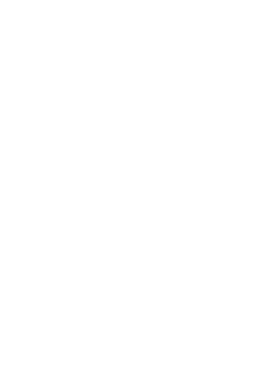

<!-- PROJECT SHIELDS -->
<!--
*** I'm using markdown "reference style" links for readability.
*** Reference links are enclosed in brackets [ ] instead of parentheses ( ).
*** See the bottom of this document for the declaration of the reference variables
*** for contributors-url, forks-url, etc. This is an optional, concise syntax you may use.
*** https://www.markdownguide.org/basic-syntax/#reference-style-links
-->
[![Contributors][contributors-shield]][contributors-url]
[![Forks][forks-shield]][forks-url]
[![Stargazers][stars-shield]][stars-url]
[![Issues][issues-shield]][issues-url]
[![License][license-shield]][license-url]

<!-- PROJECT LOGO -->
 

  

  

    A tool to help kickstart new out of tree zephyr projects using the West meta-tool
     
     
    <a href="https://github.com/OmegaRelay/west-project-init/issues/new?labels=bug&template=bug-report---.md">Report Bug</a>
    &middot;
    <a href="https://github.com/OmegaRelay/west-project-init/issues/new?labels=enhancement&template=feature-request---.md">Request Feature</a>
  

## Changelog

All notable changes to this project will be documented in this CHANGELOG.md file.
 
The format is based on [Keep a Changelog](http://keepachangelog.com/)
and this project adheres to [Semantic Versioning](http://semver.org/).

<!-- MARKDOWN LINKS & IMAGES -->
<!-- https://www.markdownguide.org/basic-syntax/#reference-style-links -->
[contributors-shield]: https://img.shields.io/github/contributors/OmegaRelay/west-project-init.svg?style=for-the-badge
[contributors-url]: https://github.com/OmegaRelay/west-project-init/graphs/contributors
[forks-shield]: https://img.shields.io/github/forks/OmegaRelay/west-project-init.svg?style=for-the-badge
[forks-url]: https://github.com/OmegaRelay/west-project-init/network/members
[stars-shield]: https://img.shields.io/github/stars/OmegaRelay/west-project-init.svg?style=for-the-badge
[stars-url]: https://github.com/OmegaRelay/west-project-init/stargazers
[issues-shield]: https://img.shields.io/github/issues/OmegaRelay/west-project-init.svg?style=for-the-badge
[issues-url]: https://github.com/OmegaRelay/west-project-init/issues
[license-shield]: https://img.shields.io/github/license/OmegaRelay/west-project-init.svg?style=for-the-badge
[license-url]: https://github.com/OmegaRelay/west-project-init/blob/main/LICENSE
